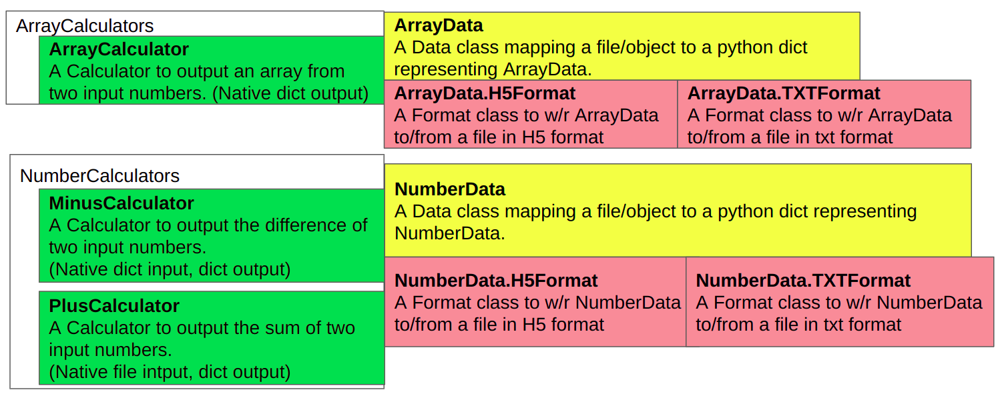
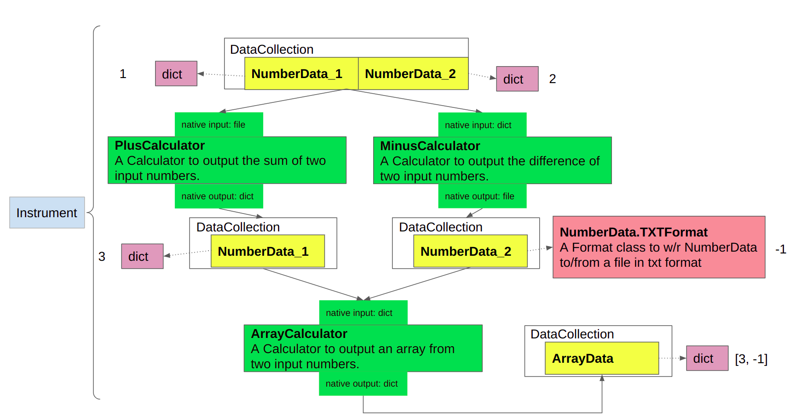

=========
PlusMinus
=========

An example of a small platform implementing libpyvinyl.

Data structure
##############

Instrument example
##################

This package was created with Cookiecutter_ and the `audreyr/cookiecutter-pypackage`_ project template.

.. _Cookiecutter: https://github.com/audreyr/cookiecutter
.. _`audreyr/cookiecutter-pypackage`: https://github.com/audreyr/cookiecutter-pypackage
